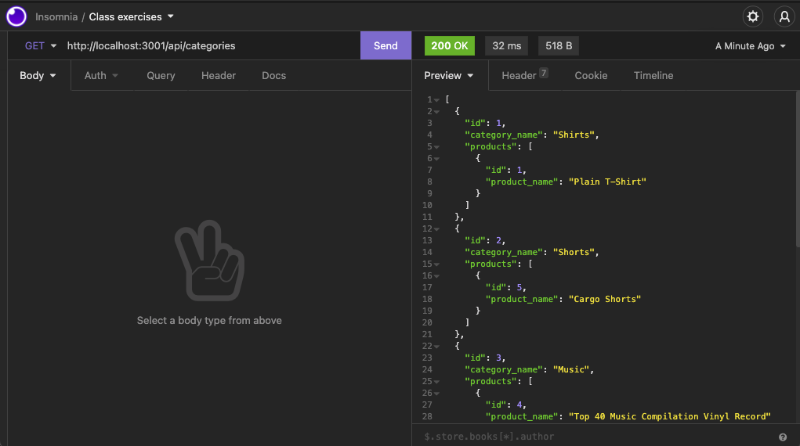

# Superstore
E-Commerce site built with Sequelize and Express.js

You are looking at the next Amazon.com! Just kidding, but it is a pretty awesome little fully functional e-commerce site. 

Demo video at (link here)

## Table of Contents

- [Installation](#installation)
- [Usage](#usage)
- [License](#license)
- [Contributions](#contributions)
- [Technologies](#technologies)
- [Credits](#credits)
- [Questions](#questions)

## Installation

Install MySQL on your machine. Use "npm install" to install required modules for this application. Create your own .env file add add your MySQL credentials. Create database, tables, and seeds by running "SOURCE db/schema.sql". Run "node server" to test out the app at "http:/localhost:3001".

## Usage

...........

## License

This project is licensed under the MIT license.

## Contributions

Fork the project and create a pull request. Let me know how you think you can contribute!

## Technologies

Created with Express.js, MySQL, MySQL2, and Node.js.

## Credits

Created by Joshua Schermann

## Questions

Post an issue if you see a bug or suggested improvement.

AS A manager at an internet retail company
I WANT a back end for my e-commerce website that uses the latest technologies
SO THAT my company can compete with other e-commerce companies

GIVEN a functional Express.js API
WHEN I add my database name, MySQL username, and MySQL password to an environment variable file
THEN I am able to connect to a database using Sequelize
WHEN I enter schema and seed commands
THEN a development database is created and is seeded with test data
WHEN I enter the command to invoke the application
THEN my server is started and the Sequelize models are synced to the MySQL database
WHEN I open API GET routes in Insomnia Core for categories, products, or tags
THEN the data for each of these routes is displayed in a formatted JSON
WHEN I test API POST, PUT, and DELETE routes in Insomnia Core
THEN I am able to successfully create, update, and delete data in my database